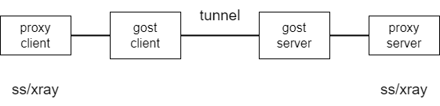
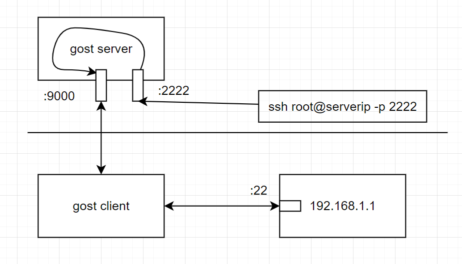

# gost Example
Help you to use gost.  
gost is a very good tunnel tool.  
But it's document is not very clear.  
And gost itself is very very complicated, because it's powerful.  

Here, I want to show some examples to help ordinary users to use gost.  
It doesn't mean gost can only do this. Just because gost is too powerful for everyone to handle. A little sample is enough for we to surf internet.    


## Introduce
version 2 is here https://github.com/ginuerzh/gost  
version 3 is here https://github.com/go-gost/gost            
**version 3 is now under developing. Not for publishing.**  

Offical DOC site for version 2: https://v2.gost.run/  
Offical DOC site for version 3: https://gost.run/


## Download and run
Open release page to down the binaries for your platform.  
version 2: https://github.com/ginuerzh/gost/releases  
version 3: https://github.com/go-gost/gost/releases  
**In version 3 release page,there is gost_amd64v3.tar.gz, It means the cpu support amd64v3, If you don't know what's amd64v3, use amd64.tar.gz.**  

On windows, if you don't want to see the black terminal, you can use [gostGUI](https://github.com/woodlyer/gostGUI) to run gost.exe in the background.  
On Android, May be you can use [ShadowsocksGostPlugin](https://github.com/segfault-bilibili/ShadowsocksGostPlugin) .  
On IOS, May be you can use [shadowrocket](https://www.applevis.com/apps/ios/utilities/shadowrocket) .  


## gost basic
### gost default is a socks5 proxy server.  
```
# gost listen socks on :1080  
gost -L :1080
gost -L admin:123456@:1080
gost -L :1080?auth=YWRtaW46MTIzNDU2

# auth is base64(user:pass). generation method: 
echo -n 'user:pass' | base64
echo YWRtaW46MTIzNDU2 | base64 -d
```
### gost use -F to forward the socks5 request to the server
```
gost -L :1080   -F 1.2.3.4:8000
```

### gost is used to do port mapping and forwarding.  
1.gost works as a proxy
```
# server
gost -L kcp://:9000
# client 
gost -L :1080 -F kcp://server:9000
```
2.gost works as a tunnel
A tunnel is basicly a port mapping
```
# port mapping :22 to local 192.168.0.100:22
gost -L tcp://:22/192.168.0.100:22
```
port mapping through gost forward chain.
```
# set port mapping on server
gost -L relay+kcp://:9000/192.168.0.100:22
gost -L tcp://:22  -F relay+kcp://server.com:9000

# set port mapping on client
# port mapping with gost forward chain to server side, it's the same as upper cmds
# here the 192.168.0.100 is server side target ip address
gost -L  relay+kcp://:9000
gost -L tcp://:22/192.168.0.100:22  -F  relay+kcp://server.com:9000

# build tunnel with "forward" key word. It's the same as upper cmds 
./gost -L kcp://:9000/192.168.0.100:22
./gost -L tcp://:22  -F forward+kcp://server.com:9000
```


### Application protocol and Transport protocol  
Protocal support list by gost:  
These application protocals work up on the transport protocols.  

1. Application Protocols  
- http - HTTP
- http2 - HTTP2
- socks4 - SOCKS4 (2.4+)
- socks4a - SOCKS4A (2.4+)
- socks5 - SOCKS5
- ss - Shadowsocks
- ss2 - Shadowsocks with AEAD support (2.8+)
- sni - SNI (2.5+)
- forward - Forward (usually used to break down protocal, such as kcp+ss  to  kcp and ss). always work with tcp like this: "-L=tcp://  -F forward+kcp"
- relay - TCP/UDP relay (2.11+). relay is always used to do tcp relay or udp relay.  

2. Transports Protocols  
Tunnel based on these transport protocals.  
You may change the transport protocal in examples to a kind protocal listed here.  
- tcp - raw TCP
- tls - TLS
- mtls - Multiplex TLS, add multiplex on TLS (2.5+)
- ws - Websocket
- mws - Multiplex Websocket (2.5+)
- wss - Websocket Secure Websocket based on wss
- mwss - Multiplex Websocket Secure, multiplex on TLS secured Websocket (2.5+)
- kcp - KCP (2.3+)
- quic - QUIC (2.4+)
- ssh - SSH (2.4+)
- h2 - HTTP2 (2.4+)
- h2c - HTTP2 Cleartext (2.4+)
- obfs4 - OBFS4 (2.4+)
- ohttp - HTTP Obfuscation (2.7+)
- otls - TLS Obfuscation (2.11+)

3. How to choose a good transport protocol?  
kcp and quic are based on udp. If udp is OK you cannot use them.  
kcp support tcp mode.  use like this:  ./gost -L=kcp://:9000?tcp=true  
tls / mtls is widely used when use tcp.   
ws / wss / http is a little lower efficiency than tls.


## Tunnel Network Knowlege

gost is named from "GO Simple Tunnel", and it's always used as a tunnel.  
Although gost can works as a proxy.  

When gost works as tunnel, the network is like this.  
Gost client and gost server set up a tunnel to serve for proxy server run on.



## gost Tunnel Example

The first line is for gost server, running on VPS.  
The second line is for gost client, running on your PC.

Suppose you are running SS(shadowsocks) or v2ray on 8388, on the client side, the gost tunnel works on 127.0.0.1:8083 links to SS or V2ray on your server.  
You should modified the server_ip to your own domain name or ip address.   
Gost supports many protocol. Such as quic, kcp, wss, tls etc. You may change the protocal to the one you need.  
 **!!!caution!!!**  
In the example, I write "tcp://127.0.0.1:8083",  gost only serve for this PC.   
If you want to serve for other PC,  you should write "tcp://:8083" .  


- kcp tunnel  
I recommend you use kcp. kcp protocal is based on udp.  
kcp can speed up your connection and keep your connection secure.

```
# server,  ss or v2ray listen on 8083 
./gost -L kcp://:9000/:8083 
./gost -L tcp://127.0.0.1:8083  -F forward+kcp://server_ip:9000
```
If you want to change some parameter of kcp. you can write a file named "kcp.json" and append it into cmd.  
like this:  
```
./gost -L kcp://:9000/:8083?c=./kcp.json 
./gost -L tcp://127.0.0.1:8083  -F forward+kcp://server_ip:9000?c=./kcp.json
```

I recommend you to change the kcp.json. But default parameter doesn't matter much.   
More info about kcp parameter. see: https://github.com/xtaci/kcptun  
kcp.json :
``` json
{
    "key": "it's a secrect",
    "crypt": "aes",
    "mode": "fast",
    "mtu" : 1350,
    "sndwnd": 1024,
    "rcvwnd": 1024,
    "datashard": 10,
    "parityshard": 3,
    "dscp": 0,
    "nocomp": false,
    "acknodelay": false,
    "nodelay": 0,
    "interval": 40,
    "resend": 0,
    "nc": 0,
    "sockbuf": 4194304,
    "keepalive": 10,
    "snmplog": "",
    "snmpperiod": 60,
    "tcp": false
}
```


- tls tunnel

```
./gost -L tls://:443/:8083
./gost -L=tcp://127.0.0.1:8083 -F forward+tls://server_ip:443
```

- quic tunnel
```
./gost -L quic://:1443/:8083
./gost -L tcp://127.0.0.1:8083  -F "forward+quic://server_ip:1443"
```

- dtls tunnel.  
dtls is only available in v3. 
```
./gost -L dtls://:1443/:8083
./gost -L tcp://127.0.0.1:8083  -F "forward+dtls://server_ip:1443"
```

- icmp tunnel.   
icmp tunnel is only available in v3.
```
echo 1 > /proc/sys/net/ipv4/icmp_echo_ignore_all
./gost -L icmp://:0
./gost -L :8080 -F "relay+icmp://server_ip:12345?keepAlive=true&ttl=10s"
```


## gost Proxy Examples
When gost act as a socks5 proxy.  
you can connect socks5://127.0.0.1:1080 to connect the internet.
Use kcp or other different protocal to pass the wall.  
<br/>


- tls proxy
```
./gost -L tls://:443
./gost -L :1080 -F tls://server_ip:443
```

- mtls proxy
```
./gost -L mtls://:443
./gost -L :1080 -F mtls://server_ip:443
```

- kcp proxy
```
./gost -L=kcp://:9000
./gost -L=:1080 -F=kcp://server_ip:9000
```

- kcp proxy with fake tcp
```
./gost -L=kcp://:9000?tcp=true
./gost -L=:1080 -F=kcp://server_ip:9000?tcp=true
```


## Remote port forward
If You want to connect  remote_ip and port. But you cann't for some reason.  
So, You let the server do the port forward.   client directly connect to gost client to connect target.
client ->  [gost client:port]  -> [gost server]  ->  [target ip+port]


The cmd is like this,  kcp can be replaced with tls,quic,socks,etc...
client connect 127.0.0.1:9000 as connect to [remote_ip:port]
This cmd only need change the para(remote_ip:port) on client.  
It's very good for user.  

```
# client easily change the remote_ip and port
./gost -L relay+kcp://:9000  
./gost -L=tcp://127.0.0.1:8388/remote_ip:port   -F relay+kcp://server_ip:9000   
```

using tls to do the relay
```bash
./gost -L relay+tls://:9000 
./gost -L=tcp://127.0.0.1:8388/remote_ip:port  -F relay+tls://server_ip:9000
```


Another methods to do remote port forward.
``` bash
# server do the port forward
./gost -L kcp://:9000/remote_ip:port  
./gost -L tcp://127.0.0.1:8388 -F forward+kcp://server_ip:9000


# working. but not recommended maybe a little low efficency
./gost -L kcp://:9000   
./gost -L tcp://127.0.0.1:9000/remote_ip:port -F kcp://server_ip:9000
```


## TCP Port Mapping for relay on one PC
Use gost listen on 22 to connect 192.168.1.100:22.
Other clients which cannot connect to 192.168.1.100 can connect gost to dest.
client  ->  gost[:22]  ->  192.168.1.100:22
```
gost -L tcp://:22/192.168.1.100:22
# ssh
ssh root@127.0.0.1 -p 22   
```


## gost remote port forward

Forward the port :2222 on the server to the host(192.168.1.1:22) in client side.  
<br/>

```
# server
./gost -L kcp://:9000
# client
./gost -L=rtcp://:2222/192.168.1.1:22  -F=kcp://server_ip:9000

# ssh cmd
ssh root@server_ip -p 2222
```


## gost cmds to run KCP + SS
run gost and ss on server, SS client connect to 127.0.0.1:8838 as connect to remote server.  
```
# server 
wget --no-check-certificate  https://github.com/ginuerzh/gost/releases/download/v2.11.5/gost-linux-amd64-2.11.5.gz
gzip -dk  gost-linux-amd64-2.11.5.gz
mv  gost-linux-amd64-2.11.5  gost
chmod +x  gost
./gost -L kcp://:9000/:8388  -L ss://aes-256-gcm:passwd@127.0.0.1:8388 

# client
./gost  -L tcp://:8388  -F "forward+kcp://server_ip:9000"

# ss param
ss://aes-256-gcm:passwd@127.0.0.1:8388 
```
ss cipher method contains:
```
1. AES-256-CFB  
2. AES-128-CFB  
3. CHACHA20  
4. CHACHA20-IETF  
5. AES-256-GCM  
6. AES-128-GCM  
7. RC4-MD5  
```


## gost cmds to run KCP + V2ray  
v2ray is a little complicated than ss.  
but more popular.  
If you want to run gost tunnel to support v2ray, please see  [v2ray dir in this repository](./v2ray).


# Compare to other tools
- gost is a tunnel or proxy. gost support many protocol(such as tls,wss,quic,kcp...).  
quic with gost is slow.  
- hysteria is based on quic(modified), tcp or udp, act as tunnel or proxy. It support obfs, so will not be blocked for using quic.  
- tuic is based on standard quic, and is the most fast. But maybe blocked for quic.  
- kcptun is a good kcp tunnel, but it is blocked now. Use kcp of gost is OK.  
- xray or v2fly. It's used by many people. They are the main enemy of GFW. based on tcp.   

hysteria:  https://github.com/apernet/hysteria  
tuic:      https://github.com/EAimTY/tuic  
kcptun:    https://github.com/xtaci/kcptun  
xray:      https://github.com/XTLS/Xray-core  


# Some tips
## how to run gost at background
- run gost at background in Linux  
use nohup to run gost in background and the log redirect to gost.log  
``` 
  nohup ./gost -L mtls://:443  >> gost.log  2>&1 &
```

- run gost as a service  
use systemd to install gost as a service.  
more info see [gost service](./service).


## run gost in openwrt
Some openwrt system has can install gost easily by opkg. https://github.com/SuLingGG/OpenWrt-Rpi  
The gost build for openwrt info is here:  https://github.com/kenzok8/openwrt-packages/tree/master/gost  
luci-app-gost is the web page to admin gost. see: https://github.com/kenzok8/openwrt-packages/tree/master/luci-app-gost  


## Doesn't have a VPS?
Oh, It's very easy. Buy one.  
- [bandwagonhost](https://bandwagonhost.com/aff.php?aff=56257)   $49.9 for 1 year.
- [vultr.com](https://www.vultr.com/?ref=7621285)  Easy to use.
- [DMIT](https://www.dmit.io/)   Many data center.
- [racknerd.com](https://my.racknerd.com/aff.php?aff=3278) It's very cheap. Click this link to buy  is cheap [BlackFriday](https://www.racknerd.com/NewYear/).  Only $10.28 for 1 year. If you want the net is fast, you should buy $24 vps, and select Location to Los Angeles.
- [arvancloud.ir](https://arvancloud.ir) It's used by many Iran people. It support bitcoin and USDT.  
- [ApeWeb](https://cms.apeweb.uk/index.php?rp=/store/global-customers) Cheap, accepts customers globally including Iran and takes crypto currency. Servers in Europe. 


## Still don't know how to do?
If you have read this document and don't know how to use gost, maybe you don't need to waste some more time on it.  
Please use some commercial mature VPN service.   
Such as:
- 1.[justMysocks.net](https://justmysocks.net/members/aff.php?aff=24386)   
- 2.[ExpressVPN](https://www.expressvpn.com/) 
- 3.[StrongVPN](https://www.strongvpn.com) 


## Star 
You have read to here, why not click the star button for once?


# Welcome Pull Requests


